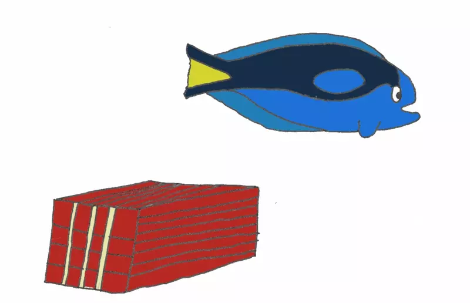
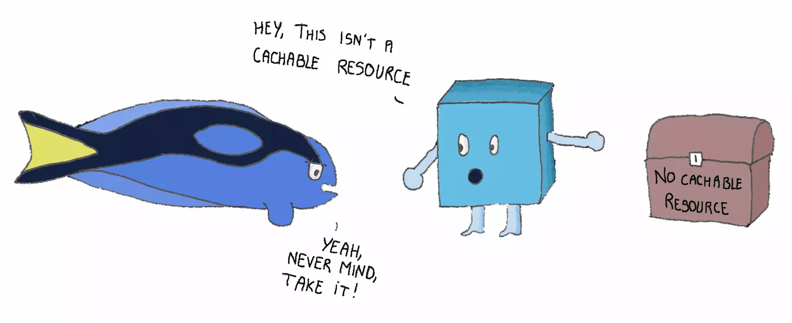

# 4种缓存的故事

作者：Yoav Weiss（[原文链接](https://calendar.perfplanet.com/2016/a-tale-of-four-caches/)）

已经有很多人讲过与浏览器缓存相关的[预加载](https://www.smashingmagazine.com/2016/02/preload-what-is-it-good-for/)、[HTTP/2 push](https://blog.yoav.ws/being_pushy/)、[Service Worker](https://developers.google.com/web/fundamentals/getting-started/primers/service-workers)等主题，但也留下诸多疑惑。

所以，我想给你讲一个故事，关于一个请求的旅行，它是如何完成使命，找到匹配的资源的。

以下故事的术语和概念来自Chromium，但在其他浏览器中也没有本质区别。

## 小求的旅行

小求是一个请求（request）。它由渲染引擎（简称渲染器）产生，带着一个紧急需求：找到那个它为之而生的资源然后与它幸福地生活下去，直至选项卡关闭、当前文档解离。

所以小求开始了追寻幸福的旅程。但它要去哪里找到那个正确的资源呢？

要找的最近的地方是……

## 内存缓存（Memory Cache）

内存缓存有一个充满各种资源的容器。它包含了所有渲染器抓取的用于组成当前文档的资源，并在文档的生命周期中一直保存着。这意味着如果小求在找的资源已经在当前文档的其他地方被抓取了，这个资源就可以在Memory Cache中找到。

但把这样的缓存称为短期记忆可能更合适。内存缓存只在当前导航保存着资源，在一些情况下，保存时间甚至更短。

小求寻找的资源可能早已抓取完成，潜在原因有很多。

[预加载器](https://calendar.perfplanet.com/2013/big-bad-preloader/)是最有可能的原因。如果小求是在HTML解析器创建节点的过程中产生的，那么很有可能在HTML的分词阶段，预加载器就已经事先加载了相应资源。

显式的[预加载](https://www.smashingmagazine.com/2016/02/preload-what-is-it-good-for/)指令（`<link rel=preload>`）也是另一个将资源预加载到内存缓存的重要手段。

除此之外，也有可能是先前的DOM节点或CSS规则已经触发了相同资源的加载。比如说，一个页面可以包含多个`src`属性一样的``元素，这种情况下只会加载一个图片资源。允许多个元素共享同一个资源的机制就是Memory Cache。

但是Memory Cache不会随意匹配请求与资源。很显然，为了匹配一个请求和相应的资源，二者的URL必须匹配，但这还不够。它们还需要匹配资源类型（因此对图片的请求不会与脚本类型的资源匹配），CORS模式和一些其他特性也需要匹配。

规范并没有详细定义对Memory Cache的请求的匹配要点，因此不同的浏览器实现之间有细微的差别。嗯。

Memory Cache不在乎HTTP语义。即使资源具有 `max-age=0` 或 `no-cache` `Cache-Control` 首部，Memory Cache也会忽略这些首部。既然浏览器允许在当前导航中重用这些资源，那么HTTP语义在这里就没那么重要了。

唯一的例外是`no-store`指令，Memory Cache在特定情况下确实会遵守这个指令（例如当资源在分开的节点上重用时）。

所以小求过去询问Memory Cache有没有匹配的资源。哎呀，没找到呢。

小求没有放弃。它走过Resource Timing和DevTools网络注册点，并在那里注册了一个寻找相应资源的请求（这意味着它会在DevTools和Resource Timing中出现，假定它最终能找到资源）。

当注册部分完成，它头也不回地前往……

## Service Worker Cache

不像内存缓存，Service Worker不遵守任何成文规则。它基本上不可预测，只遵循Web开发者给它们的指示。

首先，Service Worker只在页面安装以后了才会存在。因为其逻辑由Web开发者使用JavaScript定义，而不是浏览器内置的，所以小求无法得知它是否会在这里找到资源。而且即使找到了，那个资源会是自己梦寐以求的那一个吗？那会是一个储存在缓存中的匹配资源吗？或者仅仅是Service Worker经复杂的逻辑作出的一个精巧的响应？

没人知道。因为Service Worker有自己的逻辑，它们可以通过它们认为合适的方式来匹配潜在资源并打包在Response对象中。

Service Worker有一个cache API，让它得以保存资源。它与内存缓存的一个主要区别是它的缓存可以长期存在。保存在缓存中的资源即使在选显卡关闭或浏览器重启后也不会丢失。缓存中的资源被清除的一个可能是开发者显式清除（使用`cache.delete(resource)`）。另一个可能是浏览器用光了储存空间，在这种情况下，整个Service Worker的缓存都会被抹除，同时其他原生储存如indexedDB、localStorage等也会被抹除。据此Service Worker可以知道缓存中的资源与其他的原生存储内容同步。

Service Worker对一个特定的范围负责，这个范围最大也就是一个主机（host）。因此Service Worker只能响应这个特定范围内的文档的请求。

小求上前询问Service Worker有没有它需要的资源。但Service Worker没有在它的范围中见过这个资源，因此也没有相应的资源给小求。所以Service Worker将小求发送出去（调用fetch()函数），让它继续在危机四伏的网络堆栈中继续寻找资源。

一旦到了网络堆栈，寻找资源最合适的地方就是……

## HTTP Cache

HTTP Cache（有时被称作Disk cache）与小求此前见过的缓存都不一样。

一方面，HTTP Cache是长期的，允许资源在会话间、甚至跨站点间重用。如果一个资源被一个站点缓存，那么HTTP Cache也允许其他站点重用这个资源。

同时，HTTP Cache遵守HTTP语义（从名字就可以看出来）。它会提供它认为新鲜的资源（基于缓存的生命周期，这由它们的响应中的缓存首部决定），重新验证需要[再次验证](https://www.mnot.net/cache_docs/#VALIDATE)的资源，并拒绝储存它不应该储存的资源。

因为缓存是长期的，它也需要清除资源。但不像Service Worker的缓存，这里的资源可以一个一个地清除，以腾出空间储存更重要或更受欢迎的资源。

HTTP Cache有一个基于内存的组件，在其中完成请求和资源的匹配。但如果真的找到了匹配的资源，则需要从硬盘中取出资源的内容，这个操作可能相当耗费性能。

之前我们提到HTTP Cache遵守HTTP语义，这不完全是对的。有一个例外情况，HTTP Cache只保存资源一小段时间。浏览器有一个能力，可以为下一次导航预加载资源。可以通过显式的设置（ `<link rel=prefetch>` ）或浏览器内置的设置来实现这一点。这些预加载的资源需要保存到下一次导航为止，即使它们不可缓存。所以当这样的预加载资源到达HTTP Cache，它们会在其中保存（响应时也无需再验证）5分钟。

HTTP Cache看起来很严肃，但小求仍然鼓起勇气上前问它有没有匹配的资源。它的回答是没有:/

它只能继续向网络深处走去。前往网络的旅途充满未知与惊险，但小求知道自己无论如何都一定要找到它的资源。它只能继续前进。它找到了相应的HTTP/2会话，并准备好在其中将自己发送去网络，直到它突然看见……

## Push “Cache”

Push cache（称之为“未认领的推送流容器”更合适，但这么长的名字不适合缓存）是HTTP/2推送资源储存的地方。它们作为HTTP/2会话的一部分被保存起来，并具有几种作用。

这个容器不是长期的。如果会话中断，所有未认领的资源（即没有相应匹配的请求）都会消失。如果一个资源是由另一个的HTTP/2会话获取的，那么它[不会获得匹配](https://bugs.chromium.org/p/chromium/issues/detail?id=669515)。资源只在推送缓存容器中保存一小段时间（基于Chromium的浏览器是5分钟）。

推送缓存使用URL和请求首部来匹配请求，但并不严格遵守HTTP语义。

推送缓存在规范中也没有详细定义，不同的浏览器、操作系统和其他HTTP/2客户端会有不同的实现。

小求不抱希望地问push cache是否有匹配的资源。出乎意料的是，它有！！小求获取了这个资源（即它从未认领容器中移除了这一段HTTP/2流），它像贝壳一样张嘴笑了起来。现在它可以带着资源启程回去渲染器那里了。

一旦它们离开网络堆栈，回到Service Worker的领地，Service Worker会储存一份资源拷贝在它的缓存里，再将它们送回渲染器那里。

最后，当它们回到渲染器那里，Memory Cache会持有那个资源的引用（而非拷贝），让它可以在以后需要时将这个资源分配给相同导航的资源请求。

它们从此就幸福地生活在一起了，直至文档解离，双双进入垃圾回收器。

但那是另一个故事了。

## 总结

所以，我们从小求的旅程中学到了什么呢？

- 不同的请求可以匹配浏览器中不同缓存中的资源
- 请求匹配到的缓存会在DevTools和Resource Timing中有所体现
- 推送的资源不会长期储存，除非它们的流被请求采纳
- 不可缓存的预加载资源在下一次导航中就会被清除
- 仍然有许多地方规范并未定义清楚，在这些地方看见的行为也依浏览器实现而有所不同。我们需要解决这个问题

总而言之，如果你正在使用预加载、H2推送、Service Worker或别的先进技术来加速你的站点，你可能会注意到内部缓存以不同的样子实现。留意这些内部缓存的运行机制可以帮助你更好地理解正在发生的事情，也有助于避免不必要的阻碍。

感谢Tim Kadlec和Jake Archibald对本文章早期版本的审阅。也非常感谢Yaara Weiss，各方面都非常出色的小孩，贡献了本文的插图。

译者附：

[HTTP/2服务器推送](https://developers.google.com/web/fundamentals/performance/http2#%E6%9C%8D%E5%8A%A1%E5%99%A8%E6%8E%A8%E9%80%81)

[HTTP/2推送已死](https://evertpot.com/http-2-push-is-dead/)

