*本文原载于*[*24ways*](https://24ways.org/2016/css-writing-modes/)*，作者为*[*Jen Simmons*](https://24ways.org/2016/css-writing-modes/#author)*，未经许可，禁止转载。*

鉴于你可能时间不多，我会先上“餐后甜品”，从结尾讲起。

你可以用一个鲜为人知、然而很重要、很强大的CSS属性来使文本竖向排列，像这样：

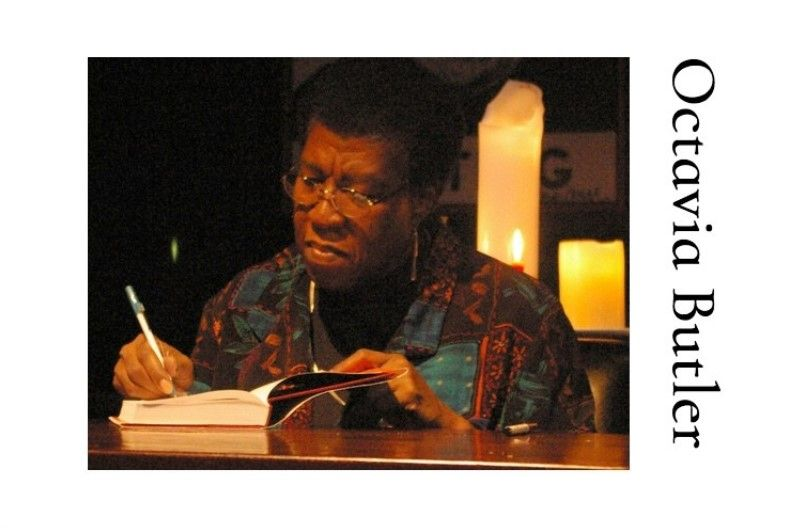


除了竖向排列文本，你还可以竖向排列图标、按钮和任何页面上的元素。

我应用的 CSS 使浏览器重新思考这个世界的方向，让这个元素以与正常方向成 90 度的方向流动。查看下面的实时演示。选中标题，看看现在光标是怎么在侧面的。

https://labs.jensimmons.com/2017/03-005.htmllabs.jensimmons.com/2017/03-005.html

实现这个效果的代码很简单：

```
h1 { 
  writing-mode: vertical-rl;
}
```

仅这一行代码就能把网页的书写模式从默认的横排从上到下（horizontal top-to-bottom mode）转换成竖排从右到左（vertical right-to-left mode）。如果你将代码应用在html元素，整个页面都会转过来，滚动方向也会受影响。

在上面的例子中，我告诉浏览器只需要将 h1 转换成 vertical-rl 模式，页面其余部分就保持默认的 horizontal-tb。

好了，餐后甜点已经结束。让我呈上正餐，阐释一下CSS书写模式的[规范](https://drafts.csswg.org/css-writing-modes/)吧。

## 为什么要学习书写模式？

我之所以给你们（包括西方的读者）讲授书写模式，解释整个系统而非快速展示一些小技巧，主要有3个原因：

1. 我们生活在一个很大、很多元的世界，学习其他语言让我们着迷。你们中很多人都需要、或者有可能排版其他语言的页面，例如中文、日文和韩文。
2. 使用 writing-mode 转换字节的方向是很酷的事情。这个属性可以有很多创造性的用法，即使你只在英语环境下工作。
3. 最重要的是，我发现理解书写模式能极大地帮助我理解弹性盒和CSS栅格。在学习书写模式之前，我总觉得自己的知识缺了一大个洞，让我不能理解栅格和弹性盒的工作原理为什么是那样。当我彻底理解书写模式以后，栅格和弹性盒就变得简单多了。

无论你知不知道，书写模式是我们创造任何布局的第一块积木。你可以像25年以来我们一直所做的那样，让你的页面保持默认的从左向右方向、水平从上到下的书写模式。或者，进入一个充满全新可能性的领域，在这里内容以其他方向流动。

## CSS属性

在本文中，我会聚焦于writing-mode这个CSS属性。这个属性有5个可能的值：

```
writing-mode: horizontal-tb;
writing-mode: vertical-rl;
writing-mode: vertical-lr;
writing-mode: sideways-rl;
writing-mode: sideways-lr;
```

在CSS规范中，书写模式被设计成广泛支持多种复杂度各异的人类语言（剧透警告：真的复杂得不像话）。地球上书写语言的演变无论如何都不能用“简单”来形容。

所以我会先解释一些网页排版和书写系统的基本概念，再让你看看CSS属性能干什么。

## 行内方向、块级方向和字符方向

在web世界中，有两个概念叫块级（block）布局和行内（inline）布局。如果你写过display: block 和 display: inline，你就知道这两个概念是什么意思。

在默认的书写模式中，块级元素从页面顶端往下竖直摆放。想想一堆块级元素，例如一些段落，是怎么堆放的。它们摆放的方向就是块级方向。

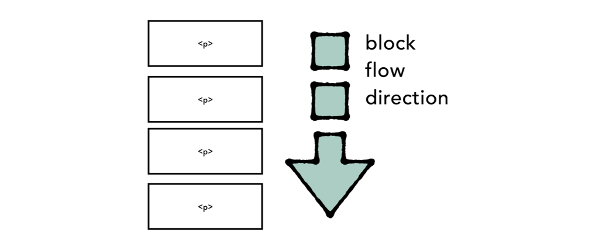


行内方向就是每一行中文字流动的方向。默认情况是，在水平的行中从左到右流动。想象一下你现在看的这行文字用打字机一个字一个字地打出来，打字的方向就是行内方向。

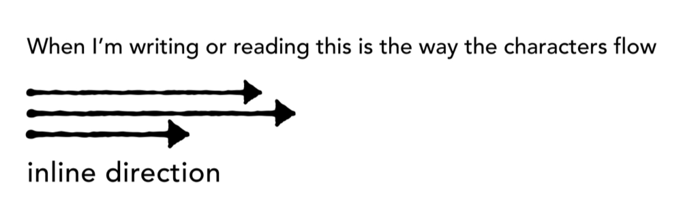


字符方向就是字符指着的方向。例如你打一个A字，哪边是字符的顶端？不同的语言会有不同的方向。大部分语言中，字符都指向页面顶端，但不是所有语言都一样。

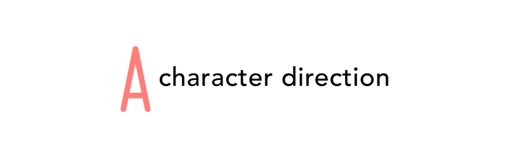


把这三个概念放在一起，就开始看到它们在整个系统中怎么运作了。

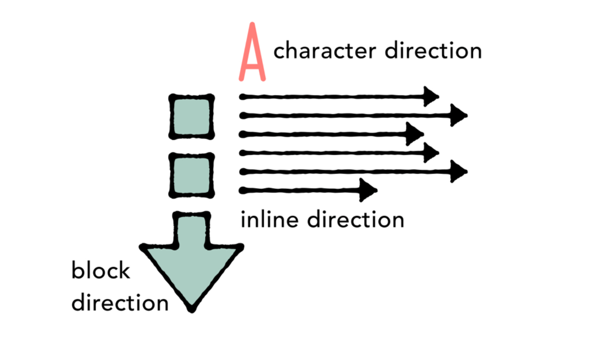


这就是网页的默认设置

现在既然我们知道什么是块级、行内、字符方向了，让我们看看世界上不同的书写系统如何使用它们吧。

## CSS书写模式中的4个书写系统

在CSS规范中，书写模式处理4个主要书写系统的用例，包括拉丁文、阿拉伯文、汉语和蒙古文。

**基于拉丁文的系统**

这个[书写系统](https://en.wikipedia.org/wiki/Writing_system)在世界上占据绝对优势，据报道其覆盖了世界上70%的人口。

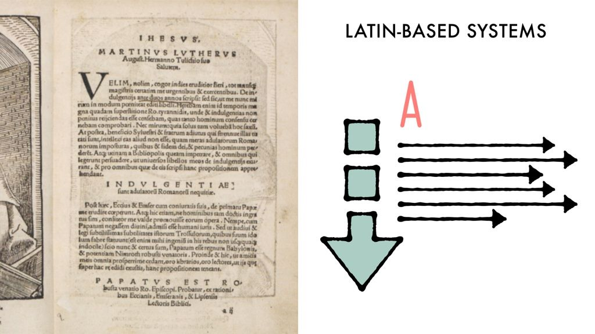


文字水平排列，从左往右流动（或称LTR）。块级方向则是从顶至底。

这被称为基于拉丁文的系统是因为这个系统包含了所有使用拉丁字母的语言，包括英语、西班牙语、法语等等。但也有非拉丁字母的语言使用这个系统，例如希腊语、西里尔字母（俄语、乌克兰语、保加利亚语等等）和婆罗米文（梵文、泰文、藏文）等等。

你不需要在CSS中手动启用这个模式，这个就是默认模式。

然而最佳实践是在<html>标签中声明你在使用哪种语言和哪种方向。例如[这个网页](https://24ways.org/2016/css-writing-modes/)使用<html lang='en-gb' dir='ltr'>来让浏览器知道网页内容使用英式英语，方向是从左到右。

**基于阿拉伯语的系统**

阿拉伯语、希伯来语和一些其他语言的行内方向是从右到左，也就是众所周知的RTL。

行内方向依然是水平的。块级方向则是从上到下。字符方向则是竖直的。

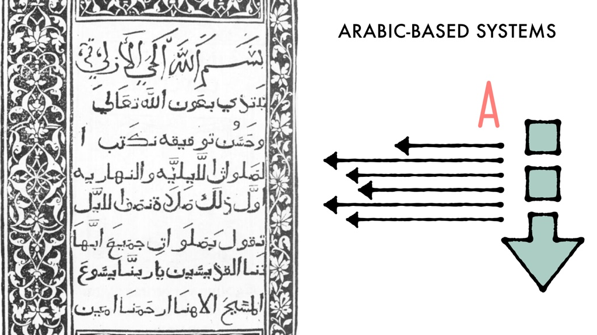


不仅文本方向是从右到左，网页中所有东西都是从右到左的。网页的右上角才是起始位置。重要的东西都放在右边。视线则从右往左看。所以典型的 RTL 网页的布局和 LTR 网页差不多，只是翻转过来了。

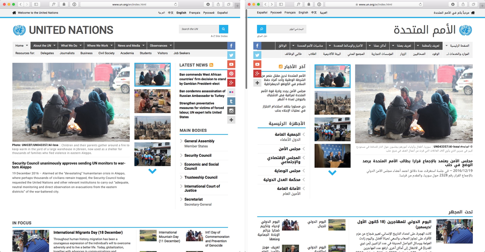


在同时支持LTR和RTL的网站中，例如联合国的网站un.org，两种布局就像彼此的镜像一样

对于很多网页开发者来说，我们国际化的经验是花点功夫支持阿拉伯语和希伯来语就好。

- 关于国际化和 RTL 的 CSS 布局技巧

以前要使一个 LTR 项目支持 RTL，开发者通常要创造各种各样的奇技淫巧。例如，Drupal 社区曾经立过一个规矩，所有的margin-left和-right，padding-left 和 -right，float: left 和 float: right，都要添加一句注释/* LTR */。然后开发者就可以通过这句注释搜索到每一个相关语句，并在样式表中将left改成right，将right改成left。这样的工作方式非常乏味，而且容易出错。CSS 需要提供更好的方式，让开发者只需要为布局写一次代码，再通过一条命令简单地将语言方向转换过来。

我们这个新的 CSS 布局系统正是如此。弹性盒、栅格和对齐方式都使用start和end而非left和right。这让我们在定义与书写系统相关的各种概念的同时，也能非常简单地转换方向。诸如justify-content: flex-start，justify-items: end和margin-inline-start: 1rem这样的代码就不需要修改了。

这是更好的工作方式。我知道将left和right改成start和end可能一时让人疑惑，但这样改动无论是对多语言项目，还是对整个互联网，都大有裨益。

令人伤心的是，我见到有些 CSS 预处理工具会“修复”这个新的 CSS 布局系统，将start和end改回left和right。他们想让你使用他们的工具，编写诸如justify-content: left这样的代码，还自觉正确无误。似乎有不少家伙认为新的工作方式很烂，应该被抛弃。然而，这个系统正是应真实需求而生，反映了全球互联网的需要。正如 Bruce Lawson 所说，WWW 的意思是万维网（World Wide Web），而不是富裕西方网（Wealthy Western Web）。千万不要让整个行业觉得不以西方文化为中心是什么错事。相反，告诉他们这个新系统诞生的原因。

花点时间将行内、块级等概念印在脑海中，习惯一下start和end，很快这就会成为新的传统了。

我也看到现在有些 CSS 预处理工具让我们采用这种新的思维方式，尽管浏览器还没完全支持所有部分。一些工具让你写text-align: start 而非 text-align: left，预处理程序会解决余下的问题。在我看来，这真是太棒了。现在我们正好可以借助这种预处理程序转变工作方式。

让我们回到 RTL。

- 如何声明方向

你应该在 HTML 而非 CSS 中告诉浏览器将 LTR 转换成 RTL，这样即使 CSS 没有加载，浏览器也知道文档该如何布局。

我们主要使用html元素来做这个事情。此外你还应该声明你的主要语言。我在前文提到，24ways 的网页使用<html lang='en-gb' dir='ltr'>来声明方向为 LTR，使用英式英语。联合国的阿拉伯网页则使用<html lang='ar' dir='rtl'>来声明网页使用阿拉伯语，布局为 RTL。

如果你在一个页面中使用多种语言，则更为复杂。但我在这里就不细说了，这篇文章主要针对 CSS 和布局，不解释有关国际化的所有细节。

我告诉你一个大致的方向吧，很多排版字符、将字符组成单词的繁杂任务都由 Unicode 负责处理。如果你想学习更多关于 LTR、RTL 和[双向文本](https://en.wikipedia.org/wiki/Bi-directional_text)的知识，看这个视频吧：[Introduction to Bidirectional Text, a presentation by Elika Etemad](https://www.youtube.com/watch?v=XgqP0qogg6U)。

与此同时，让我们回到 CSS。

- 基于拉丁语和阿拉伯语的系统中的CSS书写模式

对于基于拉丁语和基于阿拉伯语这两个系统，不管是LTR还是RTL，规定书写模式的CSS属性都是一样的：writing-mode: horizontal-tb。因为在这两个系统中，行内文本都是水平流动的，而块级方向则是从上到下。这就叫做horizontal-tb。

horizontal-tb是网页的默认书写模式，所以你不需要特意声明，除非你需要覆盖掉来自上方的属性。你可以假设你创建的所有网页都有这么一句：

```
html {
 writing-mode: horizontal-tb;
}
```

现在我们来看看竖向书写系统。

**基于汉语的书写系统**

从这里开始就有趣起来了。

基于汉语的书写系统包括CJK语言，即中文、日语、韩语以及别的语言。页面布局有两种方式，而且有时这两种方式会同时使用。

很多CJK文本会像基于拉丁语的语言一样布局，同样是水平排列的从顶至底的块级方向和从左至右的行内方向。这是更现代的布局方式，20世纪开始被很多地方采用，后来更是在电脑和互联网中被广泛使用。使用这种布局的CSS写法同上：

```
section {
 writing-mode: horizontal-tb;
}
```

或者，你知道，什么也不写，保持默认也是这样。

另外，基于汉语的语言还可以使用竖向书写模式布局，此时行内方向是竖直的，块级方向则从右往左。

在下图中看看这两种布局：

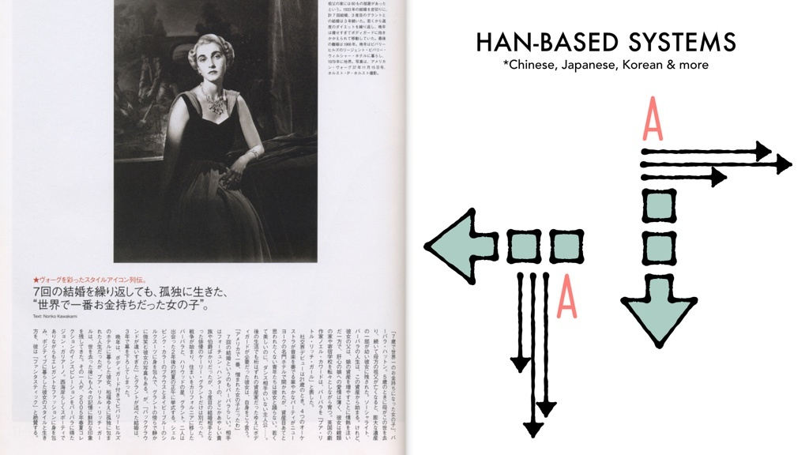


我们注意到水平的文字从左往右流动，但竖直的文字则从右往左流动。令人抓狂，对吧？

下面这本日版《Vogue》杂志混合使用了不同的书写模式。封面从左边翻开，和英语杂志正好相反。

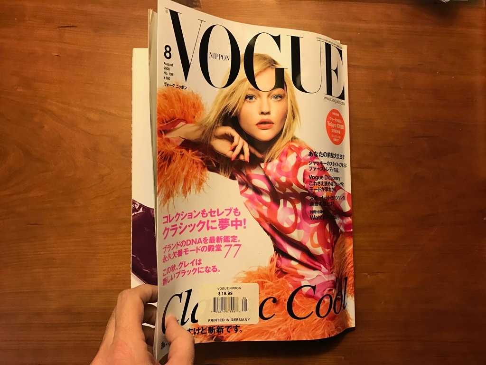


下面这一页混合了英语和日语，日语中既有水平书写模式，也有竖直书写模式。在红色标题“Richard Stark”下面，你可以看到一段文字使用horizontal-tb 和 LTR 布局。同时页面底部的一段更长的文字以vertical-rl布局。那个放大的红字标记了文章的开头。竖向文本上面的长标题布局为 LTR、horizontal-tb。

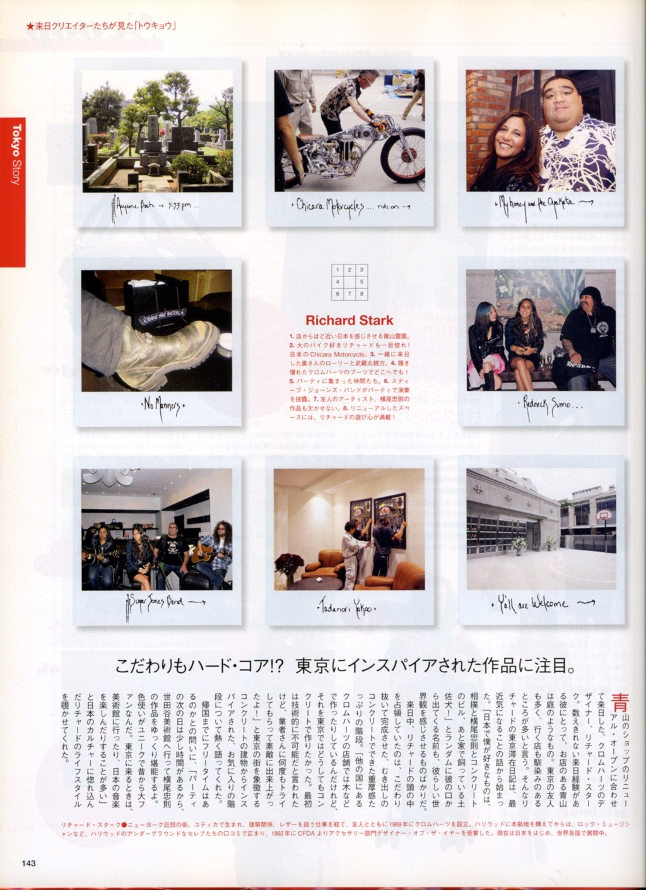


如何设置整个页面的默认值取决于你的用例。但每个元素、标题、section、article的流动方向都能按你的意愿设成与默认值不同的值。

举个例子，你可能保持默认值为horizontal-tb，然后将应该竖直的元素设成：

```
div.articletext {
 writing-mode: vertical-rl;
}
```

或者你还可以将整个页面的默认值改为竖直方向，再将特定的元素设成horizontal-tb，像这样：

```
html { 
 writing-mode: vertical-rl;
}
h2, .photocaptions, section {
 writing-mode: horizontal-tb;
}
```

如果你的页面有侧边滚动条，书写模式会决定页面是从左上角开始加载，然后滚动到右边（即我们习惯的horizontal-tb），还是从右上角开始加载，滚动到左边。这里有一个滚动方向改变的[示例](https://www.chenhuijing.com/zh-type/)（由Chen Hui Jing编写）。在她的示例中，你可以通过复选框切换书写模式为竖直或者水平，看看它们的差别。

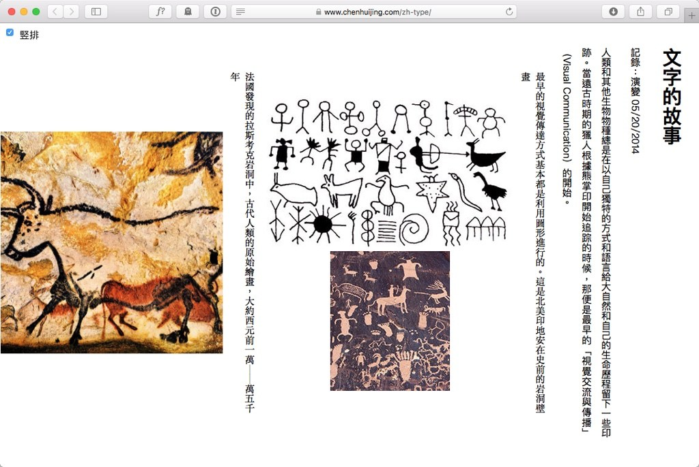


**基于蒙古语的书写系统**

希望你能理解到目前为止的内容。这些知识可能比预想中要复杂，但也不是太难。那么让我们继续讲基于蒙古语的系统吧。

蒙古语同样是竖向书写的语言。文字在页面中竖直向下书写，类似基于汉语的书写系统，但与汉语有两个大的区别。首先，块级方向不同。蒙古语的块级元素从左到右摆放。如果维基百科用蒙古语编写，并且布局正确的话，就会长下面这样：

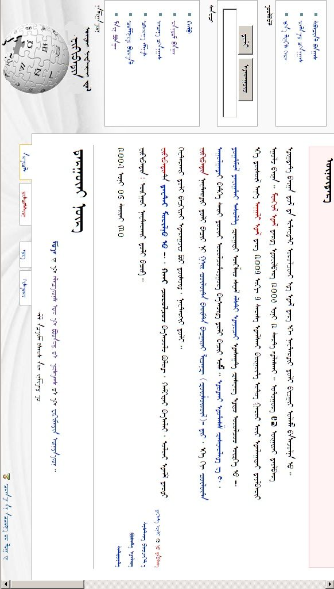


或许蒙古语的维基百科页面应该重做成这种布局

现在你可能会觉得，这看起来也不是太奇怪。把脑袋倾向左边，看起来就很熟悉了。块级方向从屏幕左边往右边流动，行内方向从页面顶端流向底部（类似于 RTL 文本，只是逆时针旋转了 90 度）。此外，还有一个大区别是，字符方向是反过来的。蒙古语字符的顶部并不指着左边，即块级方向开始的一边，而是指向右边。像这样：

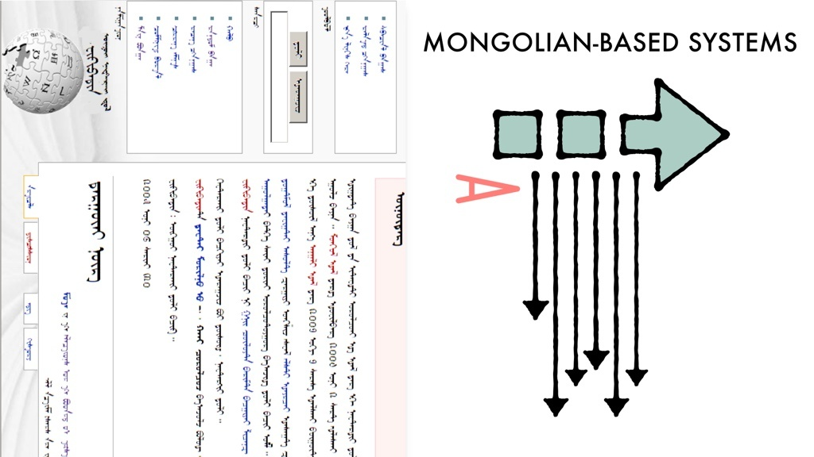


现在你可能想跳过这个部分。可能你近期不需要排版蒙古语内容，但这一部分仍然对每个人都很重要，因为writing-mode: vertical-lr正是由蒙古语的布局方式定义。这意味着我们不应该自以为是地将vertical-lr用在别的语言上。

如果我们从vertical-rl中举一反三，猜测vertical-lr怎么表现，我们可能会这么想：

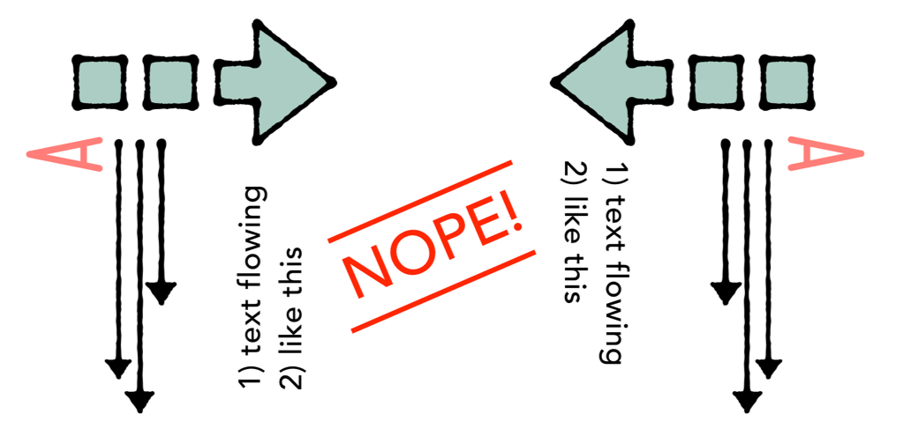


但这是错的，它们实际上应该是这样的：

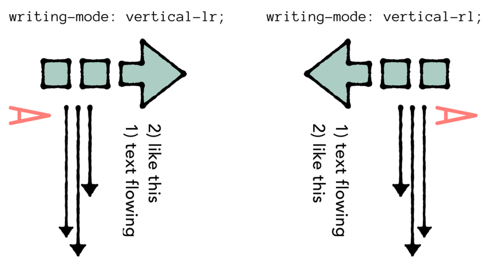


这个结果是不是出乎意料？在writing-mode: vertical-rl 和 writing-mode: vertical-lr中，拉丁字符都顺时针旋转了。两种书写模式都不能让文本逆时针旋转。

如果你在排版蒙古语内容，像排版汉语一样使用如下 CSS 就行。可以应用在html元素上以设定整个页面，也可以应用在页面的特定部分，如下：

```
section {
 writing-mode: vertical-lr;
}
```

现在，如果你想在平面设计中使用书写模式改变一个水平方向的语言，我不觉得writing-mode: vertical-lr有什么用。如果文本有两行，这样设置会让文本以出人意料的方式摆放。所以我基本上不把这个设置纳入我的工具库中。我发现自己经常用writing-mode: vertical-rl，而从来不用-lr。嗯。

## 平面设计中的书写模式

所以我们怎么用writing-mode将英语标题改成侧边显示？我们可以依靠transform: rotate()的帮助。

这里有两个例子，每个方向各一个（顺带一提，这两个例子的布局都用了栅格，所以确保你的浏览器支持 CSS 栅格，如 Firefox Nightly）。


在[例子 4A](http://labs.jensimmons.com/workshop/writingmode-4A.html)中，标题被顺时针旋转，代码如下：

```
h1 {
 writing-mode: vertical-rl;
}
```

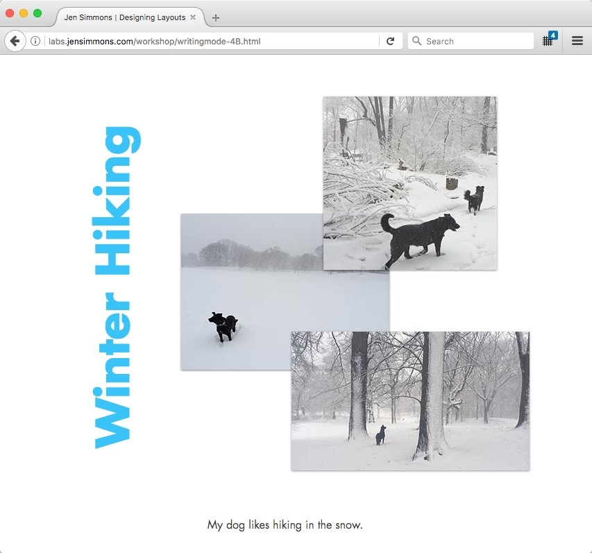


[例子 4B](http://labs.jensimmons.com/workshop/writingmode-4B.html)则把标题逆时针旋转了，代码如下：

```
h1 {
 writing-mode: vertical-rl;
 transform: rotate(180deg);
 text-align: right;
}
```

我先用vertical-rl旋转文本，让它在整个布局流中占据正确的位置。然后将它旋转 180 度以改变文字的方向。最后使用text-align: right使它上升到包含块的顶部。这看起来像歪门邪道，但也是有效的办法。

现在我想使用专门为这种情况而设的另一个值。包括这个值在内，书写模式中有两个这样的值。

如果可以的话，我会在例子 4A 中使用：

```
h1 {
 writing-mode: sideways-rl;
}
```

在例子 4B 中使用：

```
h1 {
 writing-mode: sideways-lr;
}
```

问题是这两个值只有 Firefox 支持。别的浏览器都不支持sideways-*，这意味着我们实际上还不能用它们。

而通常来说，书写模式这个属性已经得到广泛支持。所以现在我用writing-mode: vertical-rl，配合transform: rotate(180deg)来间接改变文本方向。

关于如何编写 CSS 以支持多语言还有很多可以说，但这篇中级教程应该到此为止了。

如果你还想了解更多，看看这个例子，它使用text-orientation: upright将每个原本是侧向的拉丁字母都转为竖直的了。

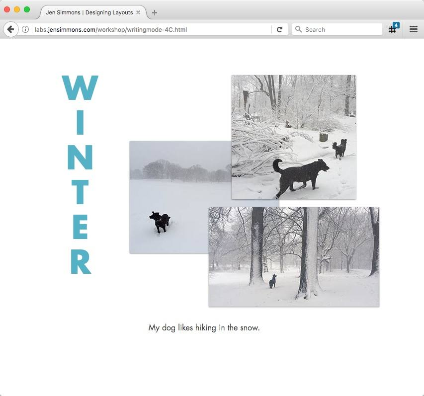


[例子 4C](http://labs.jensimmons.com/workshop/writingmode-4C.html)中的CSS如下：

```
h1 {
 writing-mode: vertical-rl;
 text-orientation: upright;
 text-transform: uppercase;
 letter-spacing: -25px;
}
```

你可以在这里查看本文所有的书写模式示例：[labs.jensimmons.com/#writing-modes](http://labs.jensimmons.com/#writing-modes)。

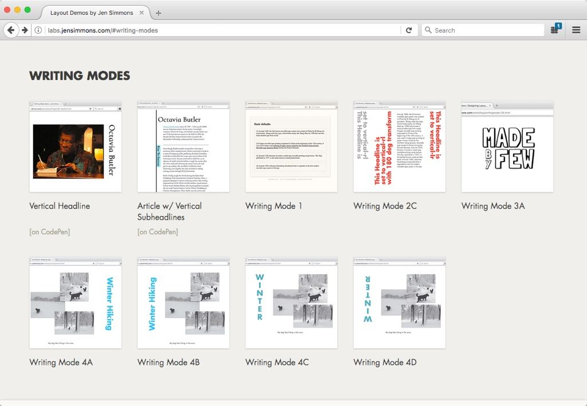


最后我以下述示例结束。在这个演示中，一篇长文的副标题使用了竖向书写模式。我喜欢这样的小细节，它们让人感觉内容焕然一新。
