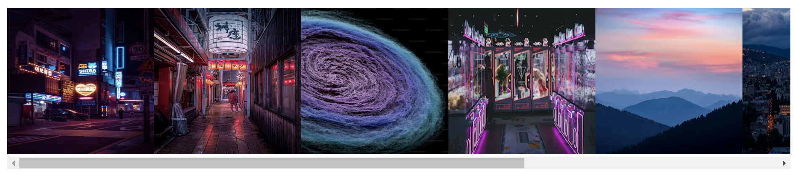
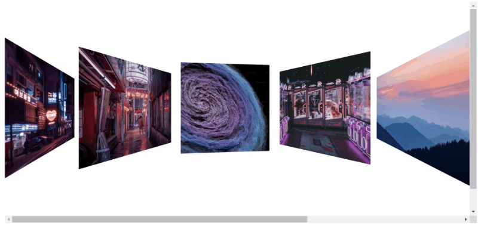
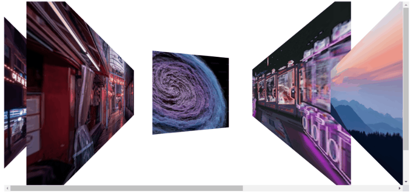
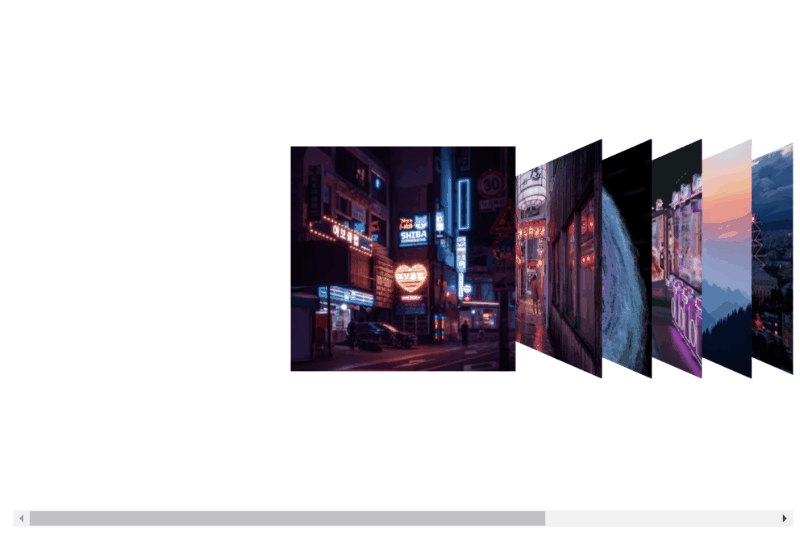
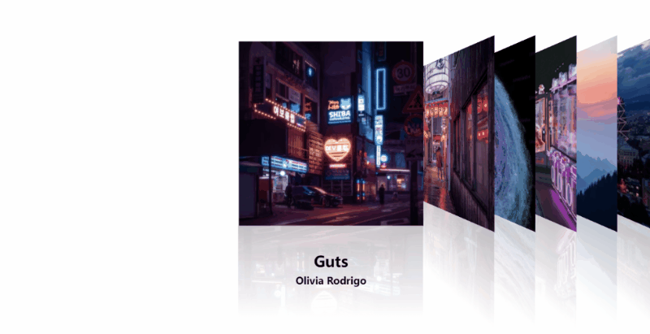

今年CSS多了很多新特性，很多以前实现起来效率很差的界面效果借助新特性都能流畅实现。比如前不久Chrome在[115版本](https://x.com/ChromiumDev/status/1679641868861157379?s=20)中带来了滚动驱动的动画（scroll-driven animations）。这个功能使得我们可以在不借助JavaScript的情况下实现随滚动播放的动画。

这篇文章我将用滚动驱动的动画和CSS Scroll Snap等特性实现cover flow动画。Cover flow最早在iTunes中出现，后来被引入至iPod、iPhone等设备中，是苹果交互设计的经典之作。


为方便起见，这篇文章使用React作为前端框架，但代码并不与React强相关。

先简单写一个图片列表。

```jsx
const coverList = [
  'https://images.unsplash.com/photo-1695249747530-57460a88ad80?ixlib=rb-4.0.3&ixid=M3wxMjA3fDB8MHxwaG90by1wYWdlfHx8fGVufDB8fHx8fA%3D%3D&auto=format&fit=crop&w=300&q=80',
  // ...
];

export const Coverflow = () => {
  return (
    <div className="coverflow">
      {coverList.map((item) => {
        return (
          <div className="cover-container">
            
          </div>
        );
      })}
    </div>
  );
};
```

我们需要横向排列的列表，简单加上一些CSS。

```css
.coverflow {
  display: flex;
  align-items: center;
  overflow-x: auto;
}

.cover-image {
  width: 150px;
  height: 150px;
  object-fit: cover;
}
```

这样就得到了一个可以横向滚动的图片列表：



为了实现滚动驱动的动画，我们需要用到几个新加入的CSS属性，`animation-timeline`，`scroll-timeline`，`animation-range`等。

`animation-timeline`用于声明动画依赖的时间线，可以用`scroll()`和`view()`函数。

`scroll()`函数表示动画的时间线依赖整个滚动进度，比如整个滚动条向下滚动了30%，动画也会进行到30%。而`view()`函数表示动画时间线依赖于元素在滚动容器可视区域中的相对位置，比如相对于元素进入容器的比例。

我们需要专辑在滚动容器的中间时正面显示，其他时候则向左或者向右收起，动画进程依赖于元素在容器可视区域中的相对位置，因此我们用`view()`。`view()`可以接收一或两个参数，分别声明滚动方向和起止位置的偏移。

这样讲有点不直观，我们直接修改一下CSS先看看效果（只写出新增或修改的CSS，下同）。

```css
.cover-image {
  animation: flip linear;
  animation-timeline: view(x);
}

@keyframes flip {
  0% {
    transform: perspective(100px) rotateY(-45deg);
  }

  50% {
    transform: perspective(100px) rotateY(0);
  }

  100% {
    transform: perspective(100px) rotateY(45deg);
  }
}
```

`view(x)`表示滚动方向是横向，动画的时间线是滚动容器的可视区域。效果如图：



看起来已经有雏形了。

但现在的效果与真正的cover flow相去甚远，我们还需要优化几个问题。第一个问题就是，动画能不能在滚动到接近中间的位置再开始播放，其他位置保持收起？想实现这一点，可以使用`view()`的第二个参数，也可以使用`animation-range`属性。`animation-range`用于指定滚动时间线的起止范围，用长度表示。

我们的图片是150px宽，因此我们以中间为分界，向左右分别扩展75px，共100px的范围。

```css
.cover-image {
  animation-range: calc(50% - 75px) calc(50% + 75px);
  /* 或使用view()的第二组参数，指定偏移量 */
  /* 向内偏移时，偏移量都是从左/右边缘开始增长的正值，所以下面两个都是减号 */
  /* animation-timeline: view(x calc(50% - 75px) calc(50% - 75px)); */
}
```

设定范围后，在范围外的图片会恢复正面显示，因此我们还需要设置一下[animation-fill-mode](https://developer.mozilla.org/en-US/docs/Web/CSS/animation-fill-mode)，在`animation`中加上both。

```css
.cover-image {
  animation: flip linear both;
}
```



这样动画范围算是正确了。但是大家也能看到，图片的形变太大；图片之间距离太远；而且右边的图片空间关系不对，左边一点的图片应该叠在右边一点的图片上面。因此我们一次性调整一下CSS。

专辑排列应该更紧凑：

```css
.cover-container:not(:first-child) {
  margin-left: -100px;
}
```

保留正确的空间关系需要用到`transform-style: preserve-3d`。这个属性会被`overflow: auto`重置（参见[之前的文章](https://aaroon.me/blog/posts/transform-style-preserve-3d-will-be-reset-to-transform-style-flat-due-to-properties-such-as-overflow/)），因此我们修改一下html结构，在外面加一层`<div>`。

```jsx
export const Coverflow = () => {
  return (
    <div className="scroll-container">
      <div className="coverflow">
        {coverList.map((item) => {
          return (
            <div className="cover-container">
              
            </div>
          );
        })}
      </div>
    </div>
  );
};
```

同时，`transform-style`不会向下继承，我们需要给从图片到公共容器之间的所有容器都加上这个属性，最后的CSS如下：

```css
.scroll-container {
  overflow-x: auto;
  display: flex;
}

.coverflow {
  display: flex;
  align-items: center;
  height: 500px;
  transform-style: preserve-3d;
}

.cover-container {
  transform-style: preserve-3d;
}
```

在容器左右加上padding，使得滚动条在最左边或最右边的时候，第一张图片和最后一张图片正好处于容器的正中间：

```css
.coverflow {
  padding: 0 calc(50% - 75px);
}
```

动画部分也要微调一下，尽量接近苹果的实现：

```css
.cover-image {
  animation: flip linear both;
  animation-timeline: view(x);
  animation-range: calc(50% - 40px) calc(50% + 40px);
}

@keyframes flip {
  0% {
    transform-origin: 80% 50%;
    transform: perspective(300px) rotateY(-60deg) translateX(100px)
      translateZ(0px);
  }

  50% {
    transform-origin: 50% 50%;
    transform: perspective(300px) rotateY(0) translateX(0) translateZ(100px);
  }

  100% {
    transform-origin: 20% 50%;
    transform: perspective(300px) rotateY(60deg) translateX(-100px);
  }
}

```

经过调整以后的效果如图：


看起来比之前好多了。

用鼠标拖动滚动条来横向滚动，这个体验不太好，我们监听一下鼠标滚轮事件，用鼠标滚轮来横向滚动。

```jsx
export const Coverflow = () => {
  function onWheel(e: React.WheelEvent) {
    const element = e.currentTarget
    element.scroll({
      left: element.scrollLeft + (e.deltaY > 0 ? 50 : -50),
    });
  }
  return (
    <div className="scroll-container" onWheel={onWheel}>
      <div className="coverflow">
        {coverList.map((item) => {
          return (
            <div className="cover-container">
              
            </div>
          );
        })}
      </div>
    </div>
  );
};
```

因为滚动是连续的，所以不能保证停止滚动的时候，正好有一张图片正面显示。此时需要用到CSS Scroll Snap。这个特性可以实现贴合滚动，它提供了几个属性，`scroll-snap-type`，`scroll-snap-align`，`scroll-snap-stop`。`scroll-snap-type`应用在滚动容器上，用于声明贴合滚动的方向和严格程度。`scroll-snap-align`应用在容器子元素上，用于声明贴合的边线。`scroll-snap-stop`也应用在容器子元素上，用于限制一次划动能不能直接划过这个元素。

直接加上CSS，看看效果：

```css
.scroll-container {
  scroll-snap-type: x mandatory;
}

.cover-container {
  scroll-snap-align: center;
  scroll-snap-stop: always;
}
```

`scroll-snap-type: x mandatory`表示在横向上应用贴合滚动。`scroll-snap-align: center`表示贴合的边线是元素的中线，`scroll-snap-stop: always`表示在一次滚动中不能跨过超过一个元素，每一个元素都应该停留。



现在，随意地滚动后，界面也会刚好停在某一张图片上了。

最后，加上倒影和专辑文字就大功告成了。这部分就不赘述了，直接看最终效果。



看起来还不错吧？

可以看到，新特性的用法比较直接简明，动画部分完全不需要JavaScript代码。在整个过程中，写滚动驱动的动画花费的时间甚至都没有我微调3D动画的时间长。如前文所述，Chrome 115已经支持滚动驱动的动画，Firefox也提供了实验性的支持，Webkit也[表示他们会支持这个特性](https://github.com/WebKit/standards-positions/issues/152)。乐观来看，不出一年所有现代浏览器都会支持这个特性。

完整的源码可以在[这里](https://stackblitz.com/edit/stackblitz-starters-4w1obr?file=src%2Fstyle.css)查看。
