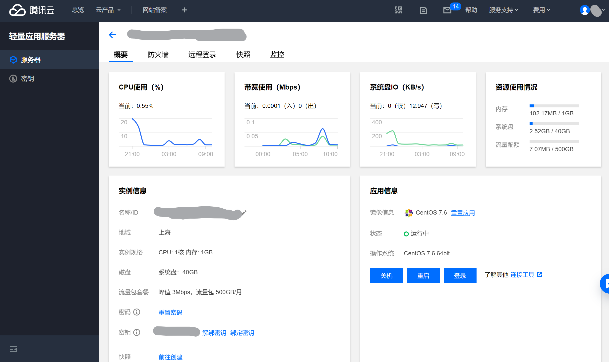

# 在远程服务器中发布Vue项目

## 申请服务器

在发布以前，需要有一台远程服务器，下面以腾讯云为例。

腾讯云提供免费使用服务（https://cloud.tencent.com/act/free），我加了9元买了两个月的轻量应用服务器。登录进入控制台以后，界面如下：



在使用前，先关机并重置密码和绑定密钥。完成以后开机。

## 使用SSH登录服务器

服务器可以直接在控制台登录，但我习惯在终端登录。最新Windows 10自带OpenSSH客户端。在powershell中输入`ssh`并回车，出现指令用法即表示SSH可用。如不可用，可打开设置应用，前往应用-应用和功能-可选应用，在那里自行打开该功能。

腾讯云提供密码登录和密钥登录两种方式（[文档](https://cloud.tencent.com/document/product/213/35700#.E4.BD.BF.E7.94.A8.E5.AF.86.E9.92.A5.E7.99.BB.E5.BD.95)）。

输入下面的指令并回车可使用密码登录。不过我使用这个指令会收到permission denied的提示，原因暂时不清楚：

```powershell
ssh <username>@<hostname or IP address>
```

使用密钥登录则需要先执行以下命令，赋予本人私钥文件的可读权限：

```powershell
icacls <下载的与云服务器关联的私钥的绝对路径> /grant <用户名>:F
icacls <下载的与云服务器关联的私钥的绝对路径> /inheritancelevel:r
```

再执行以下命令进行登录：

```powershell
ssh -i <下载的与云服务器关联的私钥的绝对路径> <username>@<hostname or IP address>
```

为了方便起见，在`C:\Users\<用户名>\.ssh`中打开config文件，输入：

```
Host root_tencent
    HostName 122.xx.xx.xx
    User <服务器用户名>
    ForwardAgent yes
    IdentityFile 私钥绝对路径
    ServerAliveInterval 120
```

其中`ServerAliveInterval 120`表示每隔120秒向服务器发送空数据包，用于保持连接。之后，就可以直接在终端输入`ssh root_tencent`来登录了。

## 安装Node

输入以下命令查看服务器系统版本：

```powershell
uname -a
```

在[Node官网](https://nodejs.org/en/download/)上复制对应版本的下载链接，使用wget命令下载，如：

```powershell
wget https://nodejs.org/dist/v14.16.0/node-v14.16.0-linux-x64.tar.xz
```

下载完成后解压；

```
tar -xvf 压缩包名称
```

还可以重命名解压后的文件夹：

```
mv 解压后的资源包名 nodejs
```

然后进入nodejs的bin目录，应该能看到node和npm两个文件。但此时我们仍不能使用全局node和npm命令，为此我们需要建立软连接：

```
ln -s /root/nodejs/bin/npm /usr/local/bin/npm
ln -s /root/nodejs/bin/node /usr/local/bin/node
```

执行以下命令，如果出现node的版本信息，就表示成功了：

```
node -v
```

更改node文件夹名称或者移动文件夹之后都需要删除原来的软连接，再建立新的。例如，删除刚刚建立的node软连接的命令如下：

```
rm -rf /usr/local/bin/node
```

## 安装git

在centOS下，git的安装非常简单，使用自带的yum包管理器安装即可：

```
yum install git
```

其他的安装方式见[官网](https://git-scm.com/book/zh/v2/起步-安装-Git)。

## 配置域名和HTTPS

腾讯云提供了[域名购买服务](https://buy.cloud.tencent.com/domain)。购买以后，在[控制台](https://console.cloud.tencent.com/cns)添加域名解析，将域名指向服务器IP。之后，可在[SSL控制台](https://console.cloud.tencent.com/ssl)申请免费DV证书，申请后按照[提示](https://cloud.tencent.com/document/product/400/4142)进行域名验证。

## 配置后端项目

使用git拉取后端项目至服务器。后端项目需要加入https的相关代码：

```javascript
const https = require('https')
const httpsOptions = {
  key : fs.readFileSync('./https/key'),
  cert: fs.readFileSync('./https/crt')
}
https.createServer(httpsOptions, app).listen(3000)
```

这里我将HTTPS证书文件放在https文件夹中。

## 配置Nginx

因为Node.js服务并不是直接暴露在公网上，而是以本地的方式跑在内网中，需要Nginx将请求转发到具体的Node.js 服务上。

为此，需要先安装Nginx。centOS的安装过程如下：

```
wget https://nginx.org/download/nginx-1.18.0.tar.gz
tar -zxvf nginx-1.18.0.tar.gz
cd  nginx-1.18.0
./configure
make
make install
```

如果出现`error: C compiler cc is not found`，使用`yum groupinstall "Development Tools"`或`dnf groupinstall "Development Tools"`安装编译器。此外，如果缺少pcre模块和zlib模块，使用以下命令安装：

```
yum install pcre pcre-devel -y
yum install -y zlib-devel
```

然后重复：

```
./configure
make
make install
```

如果依旧报错，其实官方提供了直接安装的方式：

```
安装预备工具
sudo yum install yum-utils
进入/etc/yum.repos.d，创建配置文件
cd /etc/yum.repos.d
vi nginx.repo
按i输入以下内容，按esc，再输入:wq保存并退出：
[nginx-stable]
name=nginx stable repo
baseurl=http://nginx.org/packages/centos/$releasever/$basearch/
gpgcheck=1
enabled=1
gpgkey=https://nginx.org/keys/nginx_signing.key
module_hotfixes=true

[nginx-mainline]
name=nginx mainline repo
baseurl=http://nginx.org/packages/mainline/centos/$releasever/$basearch/
gpgcheck=1
enabled=0
gpgkey=https://nginx.org/keys/nginx_signing.key
module_hotfixes=true
默认将安装稳定版，如果需要安装mainline版，输入以下指令
sudo yum-config-manager --enable nginx-mainline
最后输入以下指令安装nginx
sudo yum install nginx
```

安装完成后，需要编写Nginx的配置文件：

```
cd /usr/local/nginx/conf
或 cd /etc/nginx
vi nginx.conf
```

在http块中添加以下配置：

```
server {
    listen       80;
    server_name  carllllo.work;
    return 301 https://carllllo.work$request_uri;
}

server {
    listen       443 ssl;
    server_name  carllllo.work;

    ssl_certificate      ssl/crt;
    ssl_certificate_key  ssl/key;

    location / {
        root   html;
        index  index.html index.htm;
        proxy_pass https://127.0.0.1:3000;
    }
}

```

return语句用于将http请求重定向为https。在https配置中，添加https证书的相关配置，我将证书放在配置文件目录的ssl文件夹下。proxy_pass将请求转到node服务中。

为了将位于本地的证书文件上传到服务器，我们需要使用[WinSCP](https://winscp.net/)。安装完成后登录即可在本地与服务器之间互传文件。如果需要密钥登录，则在登录界面依次点击高级->SSH->验证->密钥文件，传入密钥文件，若提示转格式，确认即可，转格式以后即可导入成功。

然后在服务器终端输入：

```
cd /usr/local/nginx/sbin
或 cd /usr/sbin
./nginx
```

即可启动Nginx。

如果之前已经启动了，又重启失败，可输入：

```
./nginx -c /usr/local/nginx/conf/nginx.conf
或
./nginx -c /etc/nginx/nginx.conf
./nginx -s reload
```

 重新加载一次配置文件，再重启。

如果启动时出现`the "ssl" parameter requires ngx_http_ssl_module`，说明ssl模块未安装。执行以下命令安装：

```
//进入nginx源码包目录
cd /root/nginx-1.13.8
./configure --prefix=/usr/local/nginx --with-http_stub_status_module --with-http_ssl_module

//配置完成后，运行make命令
make

//替换之前先备份
cp /usr/local/nginx/sbin/nginx /usr/local/nginx/sbin/nginx.bak

//停止nginx服务
//查询nginx主进程号
$ ps -ef | grep nginx
//从容停止Nginx：
$kill -QUIT 主进程号
//快速停止Nginx：
kill -TERM 主进程号
//强制停止Nginx：
pkill -9 nginx

将刚刚编译好的nginx覆盖掉原有的nginx
cp ./objs/nginx /usr/local/nginx/sbin/

然后启动nginx，查看配置
/usr/local/nginx/sbin/nginx -V


显示如下信息即配置成功：
configure arguments: --prefix=/usr/local/nginx --with-http_stub_status_module --with-http_ssl_module
```

## 启动后端服务

使用`node app.js`启动后端服务。

如果需要后端服务一直在后台运行，需要使用forever：

```
npm install -g forever
ln -s /root/nodejs/bin/forever /usr/local/bin/forever
forever start app.js
```

forever的常用命令：

```
npm install forever -g      #安装
forever start app.js        #启动应用
forever stop app.js | [pid] #关闭应用
forever restart app.js      #重启应用
forever stopall             #关闭所有应用
forever restartall          #重启所有应用
forever list                #显示所有运行的应用
```

若启动后端服务器后未正常退出，可输入

```
sudo lsof -i :3000
```

查看哪个进程占用3000端口，然后使用

```
kill -9 {PID}
```

终止进程。

## 将前端页面部署至Github Pages

为了方便，直接将Vue项目部署到Github Pages。PowerShell脚本如下：

```
#!/usr/bin/env ps1

# 构建
npm run build

# cd 到构建输出的目录下 
cd dist

# git 初始化与提交
git init
git add -A
git commit -m 'deploy'

# 部署到 https://<USERNAME>.github.io
# git push -f git@github.com:<USERNAME>/<USERNAME>.github.io.git master

# 部署到 https://<USERNAME>.github.io/<REPO>
# git push -f git@github.com:<USERNAME>/<REPO>.git master:gh-pages

cd -
```

然后打开相应的Github Pages页面，就可以看见部署的页面了。下次再研究怎么直接部署到服务器吧。

## 参考链接

[给你的 Node.js 项目部署 HTTPS](https://juejin.im/entry/6844903439621685256)

[Nodejs配置Https服务](https://www.jianshu.com/p/638f364e0642)

[Nginx 服务器证书安装](https://cloud.tencent.com/document/product/400/35244)

[如何终止已经在运行的服务器](https://stackoverflow.com/questions/4075287/node-express-eaddrinuse-address-already-in-use-kill-server)

[centOS安装Nginx的过程](https://juejin.im/post/6844903797597159432)

 [centOS直接安装Nginx](https://nginx.org/en/linux_packages.html#RHEL-CentOS)

[使用WinSCP上传文件](https://support.huaweicloud.com/ecs_faq/zh-cn_topic_0166284971.html)

[WinSCP使用密钥登录](https://www.cnblogs.com/doublexi/p/9835346.html)

[Nginx重启异常](https://blog.csdn.net/zhuzhezhuzhe1/article/details/83861779)

[Nginx未安装SSL模块](https://blog.seosiwei.com/detail/28)

[SSH保持连接不断开](https://www.jianshu.com/p/a84a6abf76c9)

[Linux 上Node项目一直保持启动状态](https://blog.csdn.net/vmanas_/article/details/85232422)

[Vue CLI部署](https://cli.vuejs.org/zh/guide/deployment.html)
