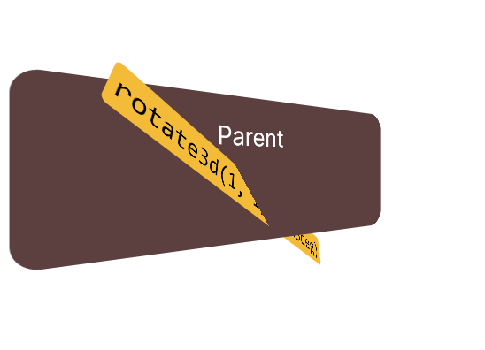
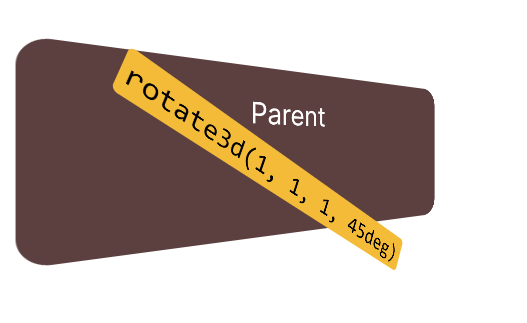
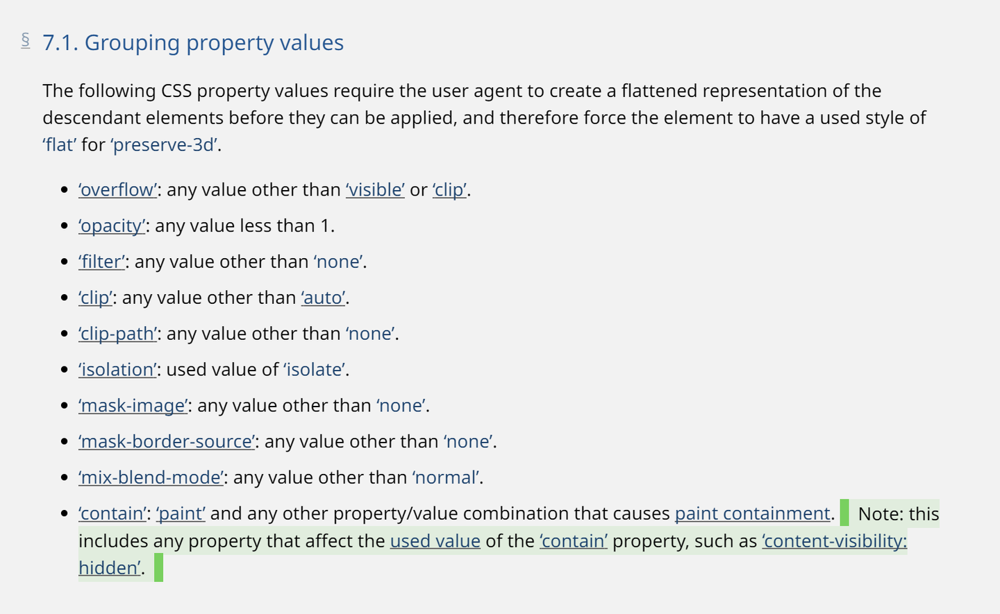

transform-style用于设置是否将子元素放在三维空间内。transform-style: preserve-3d表示将子元素放进三维空间，渲染时会计算各个子元素在三维空间中的关系，比如各种遮盖、交错等空间关系，像这样：




添加图片注释，不超过 140 字（可选）

之前在一个项目使用这个属性时，无论怎么设置，都是flat的效果，不保留三维空间的关系，像这样：




添加图片注释，不超过 140 字（可选）

经过一番对比和调试后发现，是因为应用transform-style的容器是一个滚动容器，设置了overflow: auto，去掉这个声明就可以正确显示空间关系。

但是我想知道这是浏览器的bug还是有什么别的原因，于是我找到了[这个](https://bugs.webkit.org/show_bug.cgi?id=48386)。10几年前就有人遇到了和我类似的问题。Webkit的开发者说设计如此，因为规范就是这么规定的。

transform-style的相关定义在[CSS Transforms Level 2](https://www.w3.org/TR/css-transforms-2/#transform-style-property)的规范中，里面有这样一段：




添加图片注释，不超过 140 字（可选）

意思是说overflow、opacity等属性在一些特定的取值下，会导致浏览器为transform-style: preserve-3d使用flat值。这样浏览器才能正确计算元素裁切等效果。

想绕过这个限制也很简单，不要让overflow和transform-style应用在同一个元素就行。

比如将：

```
<div style="transform-style: preserve-3d; overflow: auto;">
</div>
```

改为：

```
<div style="overflow: auto">
  <div style="transform-style: preserve-3d"></div>
</div>
```

————

后记：这是前端踩坑小记的第一篇文章。在开发过程中经常遇到的一些边边角角的坑，涉及的知识比较零散，不记录下来，过段时间就忘了。所以专门开了一个专栏，前端踩坑小记，用于记录这类经验，篇幅不长，权当查漏补缺。
