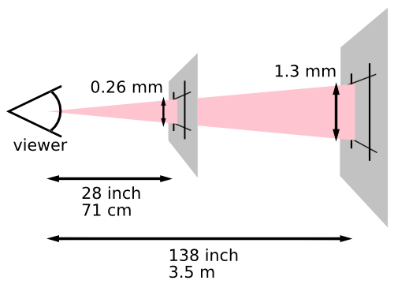
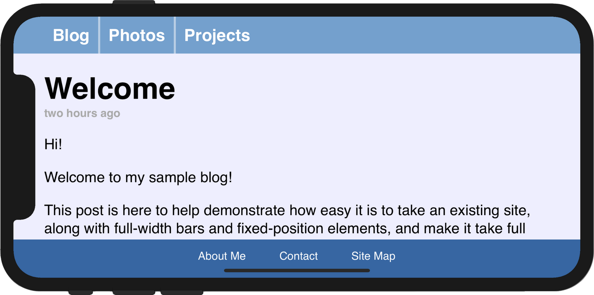

关于响应式布局有很多可以讲的东西，我写几个常见的方面，也当是自己的学习总结。

## 响应式布局

弹性盒（flex）布局是目前最流行的响应式布局方式。弹性盒是一维的，也就是说，它排布元素只能一行一行或一列一列地排，需要嵌套弹性盒或合理利用换行才能实现二维布局。具体的用法这里就不谈了。学习flex相关属性的时候需要注意各种属性的初始值。

新近的栅格布局（grid）更加强大（其实也不新了，只是兼容性还不够好 ），可以同时定义行和列，并通过fr弹性单位或minmax()函数实现响应式布局。虽然栅格布局更灵活，写起来却一点也不比弹性盒简单。

## 视区相关单位

视区（viewport）即网页的可视区域。定义容器宽高可以考虑使用vw、vh、vmin、vmax等根据屏幕尺寸计算的单位长度。1vw表示屏幕宽度的1%，1vh表示屏幕高度的1%，1vmin和1vmax则分别表示中1vw和1vh的最小值和最大值（即min(1vw, 1vh)和max(1vw, 1vh)）。

## 视区meta标签

在HTML中还有一个名为viewport的<meta>标签，最早在iOS Safari上实现 。iPhone初代发布时，一大卖点就是它能提供完整的网页浏览体验（而不是WAP版网页） 。iOS Safari的默认viewport宽度为980px ，而当时主流的电脑屏幕尺寸还是1024x768，因此大部分网页都能在iPhone上完整显示。也就是说，980px宽的网页会等比缩放到320px再显示。但如果开发者专门为iPhone写了一个网页，宽度只有320px，在iPhone上反而会变得很小。因此苹果定义了viewport meta标签，像这样：

```
<meta name="viewport" content="width=device-width, initial-scale=1">
```

其中，width表示viewport的宽度，initial-scale表示初始的缩放倍数 。device-width表示宽度为设备的宽度。这样设置以后，网页就会以320px宽显示在设备上。

随着响应式布局的普及，现在几乎所有网页都会带上这个标签。

## CSS像素

从iPhone 4开始，苹果开始使用视网膜屏幕，即高分辨率屏幕。iPhone 4比iPhone 3GS在长宽上的像素各翻了一倍，来到960x640。按照原来的定义，device-width应该是640px。但这样一来，为以前的iPhone设计的网页在iPhone 4上只有正常的1/4。 苹果采用的策略是，使用逻辑像素层，一个点（point）对应设备上的4个物理像素 （安卓也有类似概念 ）。这样一来，一个320px宽的网页在新旧iPhone上的布局就完全一致了。

关于这一点，可讲的还有很多，比如说iPhone 6 Plus的情况又有所不同 ，这里暂且略去。我们回到CSS。

CSS 2.1规范定义了参考像素（reference pixel） ，即用户在一个手臂的距离处（约71cm）观看dpi为96的设备时一个像素的大小（约为0.26mm）。由于人眼看东西近大远小，更远的屏幕相应的参考像素应该更大。



规范建议，一个CSS像素应该与一个参考像素差不多大，至于一个CSS像素由几个物理像素渲染，则由设备决定。除了前面提到的iPhone 4，PC端同样有这样的对应关系，比如近几年由于2k、4k屏逐渐普及，Windows用户通常会去调整系统的缩放比例，避免界面元素在高分屏下显得过小，这个缩放比例也会影响CSS像素的大小。

虽然前端不太关心物理像素，但应该知道这个对应关系，毕竟连Chromium也在这上面出过问题呢 。

## 媒介查询

媒介查询（media query）是为不同媒介应用不同样式的一套机制 。比如说，如果你想为印刷媒介和屏幕媒介应用不同的样式表，可以这样引入样式表：

```
<link rel="stylesheet" type="text/css" media="screen" href="screen.css">
<link rel="stylesheet" type="text/css" media="print" href="print.css">
```

针对响应式布局，有一些很有用的媒介特性描述符，比如说width、aspect-ratio、resolution、orientation等。如果我希望一组图片在PC上横向排列，在手机上纵向排列，可以这样写：

```
.picture-container {
  display: flex;
  flex-direction: row;
}

@media screen and (max-aspect-ratio: 1 / 1) {
  .picture-container {
    flex-direction: column;
  }
}
```

顺带一提，由于媒介查询同样可以使用JavaScript进行，device-aspect-ratio等获取设备比例的描述符出于安全和隐私考虑已经逐渐弃用 。

## 自适应布局与CSS框架

所谓的自适应布局（adaptive layout），即根据不同的分辨率提供不同的布局样式 。这在弹性盒等响应式布局流行起来之前曾是被广泛使用的布局方式。

比如我希望一篇文章在iPhone和电脑上都能完整显示，可以这样写：

```
.article {
  width: 980px;
}

@media (max-width: 320px) {
  .article {
    width: 320px;
  }
}
```

设备类型少的时候，这样写或许没什么问题，但设备类型一多这就是噩梦了：

```
.article {
  width: 980px;
}

@media (max-width: 320px) {
  .article {
    width: 320px;
  }
}

@media（min-width: 321px）and (max-width: 640px) {
  .article {
    width: 640px;
  }
}

@media（min-width: 641px）and (max-width: 1024px) {
  .article {
    width: 1024px;
  }
}
/* 还有更多设备…… */
```

现在有了视区单位和弹性盒，已经不需要这种繁琐的写法。

虽然我们不再需要为不同的设备写死不同的宽度，不过根据不同的宽度判断设备类型也不失为一种办法。事实上很多CSS框架也在继续沿用这样的方式，比如[Bulma](https://bulma.io/documentation/overview/responsiveness/)、[Bootstrap](https://getbootstrap.com/docs/5.0/layout/breakpoints/)等。以Bulma为例，它定义了5个断点 ：


根据这些断点来判断设备类型，从而应用不同的样式，比如为弹性盒设定不同的方向等。

## 异形屏适配

2017年，随着iPhone X发布，异形屏进入人们的视野（是的，又是苹果，苹果在用户体验方面确实下了很多功夫）。iPhone X的大刘海在横屏时会遮挡侧边的部分区域，因此在默认情况下，系统会收窄两侧区域，只用body的background-color填充 ：


有的网页可能想把内容填充到整个屏幕，苹果在前述的viewport meta标签中新定义了一个属性viewport-fit，默认值为auto，设置为cover就可以将内容扩充到整个屏幕：

```
 <meta name='viewport' content='initial-scale=1, viewport-fit=cover'>
```


但这样一来，左边的文字就被刘海挡住了。此外，下方的导航栏也与系统的导航条重合了。为此，苹果在设计规范中定义了安全区（safe area），并在webkit中实现了一个新的CSS函数env()：


我们希望文章的内容能留在安全区，可以这样写：

```
.post {
  padding: 12px;
  padding-left: env(safe-area-inset-left);
  padding-right: env(safe-area-inset-right);
}

.nav {
  padding-bottom: env(safe-area-inset-bottom);
}
```

文章的两侧就会自动增加padding以保证内容可见，下方的导航栏也也不会和系统导航条重合：



这个函数还可以用在min()、max()、calc()中，比如我希望竖屏时两边的padding为12px，但横屏时使用safe-area-inset，可以这样：

```
.post {
  padding-left: max(12px, env(safe-area-inset-left));
  padding-right: max(12px, env(safe-area-inset-right));
}
```

## 最后

需要注意，虽然简单的网页想同时适配手机端和PC端并不难，但对于本来就有复杂布局的网页来说，同时适配手机端和PC端几乎不可能做到十全十美，可以说是吃力不讨好，所以这类网站通常都先判断用户的设备类型，再分别提供手机端或PC端的网页。

1. [^](https://www.zhihu.com/question/387788930/answer/1779511490/edit#ref_-68844524_1_0)grid兼容性 https://caniuse.com/?search=grid
2. [^](https://www.zhihu.com/question/387788930/answer/1779511490/edit#ref_-23b89ddd_2_0)Viewport meta tag https://developer.mozilla.org/en-US/docs/Web/HTML/Viewport_meta_tag
3. [^](https://www.zhihu.com/question/387788930/answer/1779511490/edit#ref_-5e3cd355_3_0)iPhone初代发布会上关于Safari的介绍 https://www.bilibili.com/video/BV1C441187qa?t=2483
4. ^[a](https://www.zhihu.com/question/387788930/answer/1779511490/edit#ref_-193b0169_4_0)[b](https://www.zhihu.com/question/387788930/answer/1779511490/edit#ref_-193b0169_4_1)Using the Viewport https://developer.apple.com/library/archive/documentation/AppleApplications/Reference/SafariWebContent/UsingtheViewport/UsingtheViewport.html
5. [^](https://www.zhihu.com/question/387788930/answer/1779511490/edit#ref_1018f955_5_0)Image Size and Resolution https://developer.apple.com/design/human-interface-guidelines/ios/icons-and-images/image-size-and-resolution/
6. [^](https://www.zhihu.com/question/387788930/answer/1779511490/edit#ref_-51db4c15_6_0)安卓中的虚拟像素 https://daringfireball.net/linked/2010/04/19/android-dips
7. [^](https://www.zhihu.com/question/387788930/answer/1779511490/edit#ref_7dad643e_7_0)iPhone 6 Screens Demystified https://www.paintcodeapp.com/news/iphone-6-screens-demystified
8. [^](https://www.zhihu.com/question/387788930/answer/1779511490/edit#ref_-187004cc_8_0)Reference pixel https://www.w3.org/TR/css-values-3/#reference-pixel
9. [^](https://www.zhihu.com/question/387788930/answer/1779511490/edit#ref_58d59b69_9_0)Chromium issue 1125364 https://bugs.chromium.org/p/chromium/issues/detail?id=1125364#c_ts1599539589
10. [^](https://www.zhihu.com/question/387788930/answer/1779511490/edit#ref_4dd996e2_10_0)Media Queries https://developer.mozilla.org/en-US/docs/Web/CSS/Media_Queries
11. [^](https://www.zhihu.com/question/387788930/answer/1779511490/edit#ref_-585b96f5_11_0)https://www.w3.org/TR/mediaqueries-4/#changes-2012
12. [^](https://www.zhihu.com/question/387788930/answer/1779511490/edit#ref_-7690956b_12_0)The Difference Between Responsive and Adaptive Design https://css-tricks.com/the-difference-between-responsive-and-adaptive-design/
13. [^](https://www.zhihu.com/question/387788930/answer/1779511490/edit#ref_-7afae6c6_13_0)Breakpoints https://bulma.io/documentation/overview/responsiveness/#breakpoints
14. [^](https://www.zhihu.com/question/387788930/answer/1779511490/edit#ref_-52e7f0cf_14_0)Designing Websites for iPhone X https://webkit.org/blog/7929/designing-websites-for-iphone-x/
