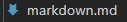
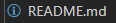
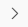
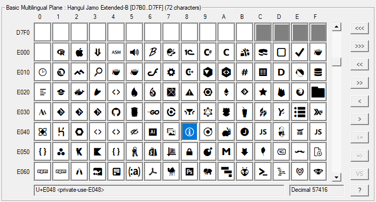
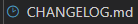

正好今天早上在好奇为什么普通 Markdown 文件旁边的图标是这个：



而 [README.md](http://readme.md/) 的图标变成了这个：



以“vscode icon”为关键词搜索到了官网的两篇文章，算是解决了我的问题，顺便也解决了题主的问题：

File and Folder Icons in Visual Studio Codecode.visualstudio.com/blogs/2016/09/08/icon-themes

Product Icon Referencecode.visualstudio.com/api/references/icons-in-labels

简单来说，VS Code 中有两套图标，题主提到的称为 product icons，而文件旁用于标示文件类型的称为 file icons。

## Product icons

Product icons 可用于编辑器中的悬停菜单、状态栏等位置，也可用于扩展中。根据用途的不同，每个图标都会有自己的标识符。而一个图标可以用来表示不同的含义，因此同一个图标也可以拥有几个不同的标识符。例如：



这个图标就有 chevron-right、folding-collapsed 和 breadcrumb-separator 三个标识符，分别表示右 V 字箭头、文件夹收起和分隔结构层级的面包屑分隔符。其他图标的含义可以在上面的文章中查看。

此外，product icons 包含在 [Codicon icon font](https://github.com/microsoft/vscode-codicons) 中，可以在 [这个页面](https://microsoft.github.io/vscode-codicons/dist/codicon.html) 中查看所有的图标和对应的默认标识符。

## File icons

VS Code 默认使用一个叫 Seti 的图标主题，可以在 Files > Preferences > File Icon Theme 中看到。

在 VS Code 的 Github 页面中翻查了一下，不难找到与 Seti 主题相关的信息在 [这个位置](https://github.com/microsoft/vscode/tree/master/extensions/theme-seti) 。在 icons 文件夹中的 vs-seti-icon-theme.json 文件记录了这个主题的相关信息。文件开头给出图标定义、图标颜色、文件关联等信息的储存位置，这些正是我想了解的信息。

在 [seti-ui 的页面](https://github.com/jesseweed/seti-ui/tree/master/styles/_fonts/seti) 中先把图标字体下载下来，用 [BabelMap](https://www.babelstone.co.uk/Software/BabelMap.html) 打开。可以看到这些图标就在 Private Use Area 中。



在这里我看到了上文的 README 图标，位置是 E048。在 [图标定义](https://github.com/jesseweed/seti-ui/blob/master/styles/_fonts/seti.less) 中可以看到，E048 代表 info。而在 [文件关联](https://github.com/jesseweed/seti-ui/blob/master/styles/components/icons/mapping.less) 中可以看到，[README.md](http://readme.md/) 使用的正是这个 info 图标。

```
// README
.icon-set("README.md", "info", @blue);
```

搜索“md”还可以看到，当 markdown 文件是以下几个名字时，使用 clock 文件图标。

```
// CHANGELOG
.icon-set('CHANGELOG.md', 'clock', @blue);
.icon-set('CHANGELOG', 'clock', @blue);
.icon-set('CHANGES.md', 'clock', @blue);
.icon-set('VERSION.md', 'clock', @blue);
.icon-set('VERSION', 'clock', @blue);
```



心满意足了，以上。