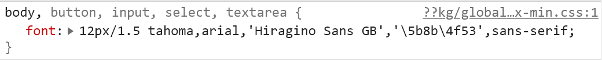

淘宝网页版的字体样式恐怕很多年没有变过了。前两个字体`tahoma`和`arial`都是英文字体。第三个`Hiragino Sans GB`是冬青黑体。第四个`\5b8b\4f53`其实就是宋体，没错，就是Windows上非常丑的中易宋体。

由于Windows没有内置冬青黑体，因此直到2021年的今天，大多数Windows用户上淘宝网都要忍受那瞎眼的宋体。鉴于国内的互联网企业越来越不重视网页端，等他们自己改恐怕是没指望了。

解决办法也很简单，一个是自行下载安装冬青黑体。因为冬青黑体并不免费，所以另一个办法是使用浏览器扩展把淘宝网的字体替换掉。最后，如果嫌麻烦的话，还可以直接换一部Mac（这很河狸

离题了，以上。