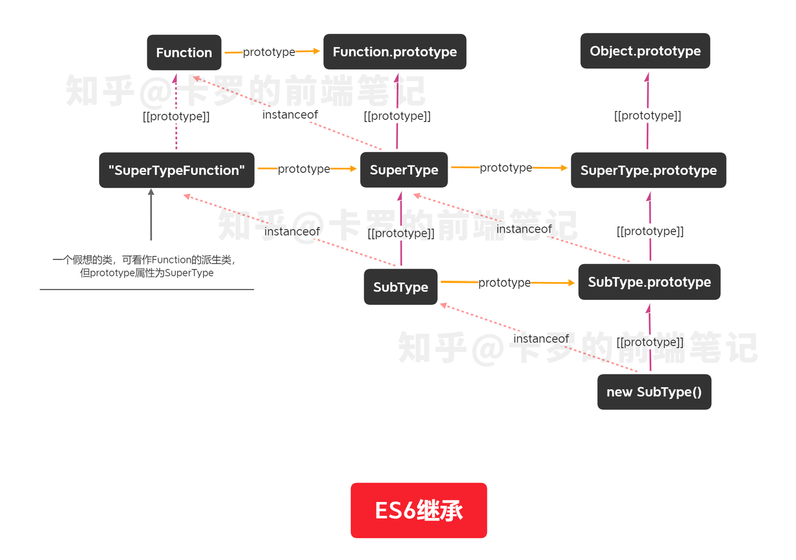

真的有人不喜欢用class吗，我就用得挺舒服的。

在class关键字和相关语法出来以前，用JavaScript写面向对象的代码有很多繁琐的细节。在《JavaScript高级程序设计》中，创建一个对象有工厂模式、构造函数模式、原型模式、组合构造函数模式和原型模式、动态原型模式、寄生构造函数模式、稳妥构造函数模式等7种不同的方法。相对应地，继承就有原型链、借用构造函数、组合继承、原型式继承、寄生式继承、寄生组合式继承等6种方法。这些方法各有优缺点，有各自所需要注意的细节。初学的时候看的我头都大了，非常劝退的一个章节。

class语法简化并统一了上述方式，在这之后，除了一些特殊场景，一般情况下只需要无脑写class就可以了。

我一开始学习class语法的时候，以为这就是一个简单的语法糖。但深入学习后，发现这么讲是以偏概全：ES6的class从底层就与ES5的类型不一样。

相比ES5中的function写法，class语法有这么几个优点：

- 类声明中的所有代码都自动运行在严格模式下
- 在类中定义的方法不可枚举，也不可使用new关键字来调用
- 使用除new以外的方式调用类的构造函数均会抛出错误

在继承方面，ES6与ES5的差别就更大了。对于继承，ES5中最常用的就是寄生组合式继承。ES6继承大致与寄生组合式继承类似。不过ES6解决了一些别的问题，例如：

- 静态成员继承

在ES5中，静态成员的继承只能通过赋值实现：

```
SubType.staticMethod = SuperType.staticMethod;
```

ES6中，派生类通过[[prototype]]指针访问基类的静态方法。这里可能会有点绕，[[prototype]]指针不是由实例对象指向构造函数的原型对象吗？是的，一般而言，JavaScript函数的[[prototype]]指针指向Function.prototype，class作为一类特殊的函数，也不例外。先来看下面的代码：

```
class SuperType {
  constructor(name) {
    this.name = name;
  }
  static staticMethod() {}
}

class SubType extends SuperType {
  constructor(name) {
    super(name);
  }
}

console.log(SubType.staticMethod === SuperType.staticMethod); // true
console.log(Object.getPrototypeOf(SuperType) === Function.prototype); // true
console.log(Object.getPrototypeOf(SubType) === Function.prototype); // false
console.log(Object.getPrototypeOf(SubType) === SuperType); // true
```

可以看到，在继承中，JavaScript内部将派生类的[[prototype]]指针改写为指向基类。这样一来，就像对象实例可以访问构造函数的原型对象上的方法一样，子类也可以通过[[prototype]]访问父类的静态方法了。

简单来说，派生类的实例通过原型链访问基类的方法，而派生类自身则通过[[prototype]]访问基类的静态方法。为了更直观地说明这个问题，我做了一个示意图：



- 内建对象继承

在ES5继承中，先由派生类型创建this的值，然后调用基类型的构造函数。也就是说，this的值一开始就指向派生类型的实例，再由基类型修饰。而ES6中则先由基类创建this值（通过super，见下文），再进入派生类的构造函数继续修改，这样一开始就可以通过this访问基类的所有内建功能，再正确接收与之相关的功能。比如说，如果使用ES5的继承方式继承内建类型Array，会发现这个派生类不能像原生Array一样通过修改length来删除元素，length也不反映数组长度。而ES6的继承则可以完美实现这一点。

```
function MyArray() {
  Array.apply(this, arguments);
}
MyArray.prototype = Object.create(Array.prototype, {
  constructor: {
    value: MyArray,
    writable: true,
    configurable: true,
    enumerable: true
  }
});
let colors = new MyArray();
colors[0] = 'red';
console.log(colors[0]); // 'red'
console.log(colors.length); // 0
colors.length = 0;
console.log(colors[0]); // 'red'

class MyArray2 extends Array {}
let colors2 = new MyArray2();
colors2[0] = 'red';
console.log(colors2[0]); // 'red'
console.log(colors.length); // 1
colors2.length = 0;
console.log(colors2[0]); // undefined
```

- 引入super关键字

super引用相当于指向原型对象的指针，即Object.getPrototypeOf(this)的值。

super有三种用法：

```
super()
super[expression]
super.indentifierName
```

super()用于调用基类的构造函数并初始化派生类的this值，后两种用法用于调用基类的方法。

super引用在多重继承的情况下很有用。在多重继承中使用getPrototypeOf()可能会导致循环引用：

```
let person = {
  hello() {
    return 'hello';
  }
};

let friend = {
  hello() {
    return Object.getPrototypeOf(this).hello.call(this) + ', hi!';
  }
}

Object.setPrototypeOf(friend, person);
let relative = Object.create(friend);
console.log(person.hello()); // 'hello'
console.log(friend.hello()); // 'hello, hi!'
console.log(relative.hello()); // error
```

super引用的内部通过[[homeObject]]属性来检索原型，搜索同名函数，最后设置正确的this值并调用相应方法，从原理上解决了循环引用的问题：

```
let person = {
  hello() {
    return 'hello';
  }
};

let friend = {
  hello() {
    return super.hello() + ', hi!';
  }
}

Object.setPrototypeOf(friend, person);
let relative = Object.create(friend);
console.log(person.hello()); // 'hello'
console.log(friend.hello()); // 'hello, hi!'
console.log(relative.hello()); // 'hello, hi!'
```

我所学到的，基本就是这么多。如果想了解相关规范制定时有什么争论、JavaScript为什么这么设计类、具体的演进等等，可以参考 JavaScript 之父 Brendan Eich 与 ES6 规范首席作者 Allen Wirfs-Brock 一起编写《JavaScript 20 年》，[这里](https://cn.history.js.org/)是 [@doodlewind](https://www.zhihu.com/people/c0e2a6c332e573b37d6f5387074ead98) 等大神的中文翻译版。

以上。

参考资料：
